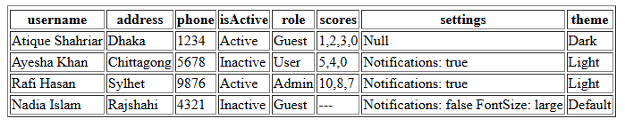
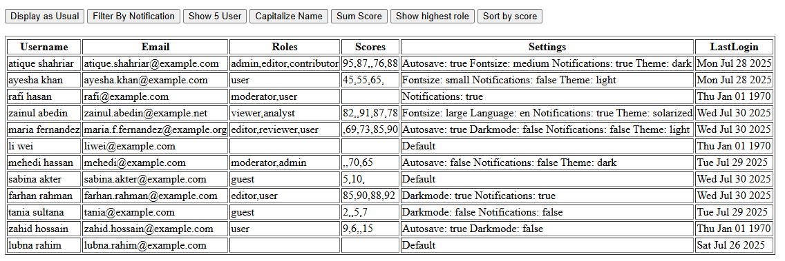
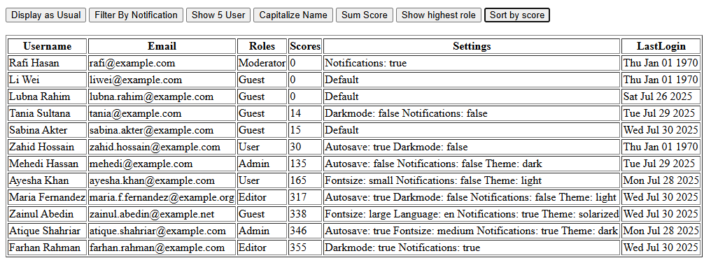

# Javascript Array

### Separate Variables vs Array vs Object

```js
// Separate variables
let score1 = 10;
let score2 = 15;
let score3 = 20;

// Array instead
let scores = [10, 15, 20];

// Object instead
let scoresObj = {
    score1: 10,
    score2: 15,
    score3: 120,
};
```

## Why not just use separate variables (a, b, c, ...)?

Problems with many separate variables:

-   Hard to manage
-   No grouping
-   No easy iteration

## Why use an Array instead of many separate variables?

-   Arrays group multiple values into a single structure.
-   You can loop over all items with `for`, `map()`, `forEach()`, etc.
-   Easy to add, remove, or modify items.

## Why use an Object instead of an Array or separate variables?

-   Objects group related data as **key-value pairs, describing properties.**
-   When data has named attributes, objects make the data meaningful.
-   Easy to access specific properties by name.

## Why need an object rather than an array?

1. Arrays use numeric keys (indexes) — **objects use arbitrary keys**
2. Arrays are for ordered lists — **objects for describing things**
3. Using meaningful keys makes code readable and logical — Arrays don’t naturally support meaningful keys

> In short:  
> **Arrays are special objects optimized for ordered data with numeric indexes, while objects are for meaningful key-value pairs with descriptive keys. Both serve different needs — that’s why we have both!**

# JavaScript Array Methods

| **Method**     | **Real-Life Use Case**                           | **Example**                                    |
| -------------- | ------------------------------------------------ | ---------------------------------------------- |
| `*push()`      | Add new data to the end of a list                | `arr.push(newItem)`                            |
| `*pop()`       | Remove last item from list                       | `arr.pop()`                                    |
| `*unshift()`   | Add item to start                                | `arr.unshift(newMsg)`                          |
| `*shift()`     | Remove first item                                | `arr.shift()`                                  |
| `map()`        | Transform each item for rendering or logic       | `arr.map(x => x * 2)`                          |
| `forEach()`    | Iterate through each element (no return)         | `arr.forEach(x => console.log(x))`             |
| `filter()`     | Create new array based on condition              | `arr.filter(x => x.active)`                    |
| `find()`       | Get the **first** matching element               | `arr.find(x => x.id === 3)`                    |
| `findIndex()`  | Get index of first match                         | `arr.findIndex(x => x.name === "Tom")`         |
| `reduce()`     | Calculate totals, combine values                 | `arr.reduce((sum, p) => sum + p.price, 0)`     |
| `some()`       | Validate if **any** item passes the condition    | `arr.some(x => x.isAdmin)`                     |
| `every()`      | Check if **all** items pass a condition          | `arr.every(x => x !== null)`                   |
| `includes()`   | Check if a value exists                          | `arr.includes("admin")`                        |
| `slice()`      | Copy/preview a part of array (pagination, top 5) | `arr.slice(start, end)`                        |
| `*splice()`    | Add/remove items at specific index (mutates)     | `arr.splice(start, deleteCount, add, add,...)` |
| `join()`       | Convert array to string                          | `arr.join(", ")`                               |
| `*sort()`      | Sort numbers, strings, or objects (mutates)      | `arr.sort((a, b) => a.price - b.price)`        |
| `toSorted()`   | Immutable version of `sort()` (ES2023+)          | `arr.toSorted((a, b) => a - b)`                |
| `reverse()`    | Reverses the array order (mutates)               | `arr.reverse()`                                |
| `toReversed()` | Immutable reverse (ES2023+)                      | `arr.toReversed()`                             |
| `at()`         | Get value by index (supports negative index)     | `arr.at(-1)`                                   |
| `flat()`       | Flatten nested arrays                            | `[1, [2, [3]]].flat(2)`                        |

> 🔹 Methods marked with a \* modify (mutate) the original array.

---

## 🔄 map() vs forEach()

| **Feature**      | **`map()`**                               | **`forEach()`**                                     |
| ---------------- | ----------------------------------------- | --------------------------------------------------- |
| **Purpose**      | Transform elements and return a new array | Perform actions per item without returning anything |
| **Return Value** | ✅ Returns new array                      | ❌ Returns `undefined`                              |
| **Use Case**     | When creating a new array                 | When doing side-effects (e.g., logging, UI update)  |

```js
// map()
const prices = [10, 20, 30];
const taxed = prices.map((p) => p * 1.15); // [11.5, 23, 34.5]

// forEach()
prices.forEach((p) => console.log(p)); // logs 10, 20, 30
```

<br><br>

# 1. Dynamic HTML Table

```js
//data format
{
    username: { firstName: "Ayesha", lastName: "Khan" },
    address: "Chittagong",
    phone: 5678,
    isActive: false,
    role: "User",
    scores: [5, 4, null],
    settings: { notifications: true },
    theme: function () {
        return "light";
    },
}
```

```js
function filteredData(profiles = allUsers) {
    const filteredData = profiles.filter(
        (profile) => profile.settings?.notifications == true
    );
    console.log(filteredData);
    showingData(filteredData);
}

function showingData(profiles = allUsers) {
    const table = document.getElementById("tableId");
    table.innerHTML = "";

    const tableHead = document.createElement("thead");
    table.appendChild(tableHead);

    const tableHeadRow = document.createElement("tr");
    tableHead.appendChild(tableHeadRow);

    Object.keys(profiles[0]).map((eachKey) => {
        const headData = document.createElement("th");
        headData.innerText = eachKey[0].toUpperCase() + eachKey.slice(1);
        tableHead.appendChild(headData);
    });

    const tableBody = document.createElement("tbody");

    table.appendChild(tableBody);

    profiles.map((eachObject) => {
        const newRow = document.createElement("tr");
        newRow.innerHTML = `
    <td>${eachObject.username.firstName} ${eachObject.username.lastName}</td>
    <td>${eachObject.address}</td>
    <td>${eachObject.phone}</td>
    <td>${eachObject.isActive ? "Active" : "Inactive"}</td>
    <td>${eachObject.role ?? "Guest"}</td>
    <td>${
        eachObject.scores.length == 0
            ? "---"
            : eachObject.scores.includes(null)
            ? eachObject.scores.map((score) => score ?? 0)
            : eachObject.scores
    }</td>
    <td>${
        eachObject.settings == null
            ? "Null"
            : Object.entries(eachObject.settings)
                  .map(([key, value]) => {
                      return `${key[0].toUpperCase() + key.slice(1)}: ${value}`;
                  })
                  .join("\n")
    }</td>
    <td>${
        eachObject.theme()[0].toUpperCase() + eachObject.theme().slice(1)
    }</td>
    `;
        tableBody.appendChild(newRow);
    });
}

showingData();
```

**Output**


## Used Array Methods

-   **`.map()`** — iterate over arrays (profiles, keys, scores, settings entries).
-   **`.join()`** — join array elements into a string.
-   **`.includes()`** — (used earlier) check for `null` in scores.
-   **`.filter()`** — filters profiles based on a condition (`notifications == true`).

## Used Object Methods

-   **`Object.keys()`** — get keys of an object (for headers).
-   **`Object.entries()`** — get `[key, value]` pairs of an object (for settings).

## Used JavaScript Operators & Features

-   **Ternary Operator**  
    `condition ? valueIfTrue : valueIfFalse` — used for conditional rendering.

-   **Nullish Coalescing Operator (`??`)**  
    Fallback value if a variable is `null` or `undefined`.

-   **Template Literals**  
    `` `...${variable}...` `` — used for building dynamic HTML strings.

-   **Optional Chaining (`?.`)**  
    Safely accesses nested properties like `profile.settings?.notifications`.

<br><br>

# 2. Dynamic HTML Table

```js
//data
{
    username: "  atique shahriar  ",
    email: "atique.shahriar@example.com",
    roles: ["admin", "editor", "contributor"],
    scores: [95, 87, null, 76, 88],
    settings: {
        theme: "dark",
        notifications: true,
        fontSize: "medium",
        autoSave: true,
    },
    lastLogin: "2025-07-28T10:15:00Z",
}
```

```js
function filteredByNotification(usersData = users) {
    const notifiedUsers = usersData.filter(
        (user) => user.settings?.notifications === true
    );
    display(notifiedUsers);
}

function slicingUser(usersData = users) {
    const newUsers = usersData.slice(3, 8);
    display(newUsers);
}

function cleanUserName(usersData = users) {
    usersData.forEach((user) => {
        user.username = user.username
            .trim()
            .split(" ")
            .map((word) => word[0].toUpperCase() + word.slice(1))
            .join(" ");
    });
    display();
}

function analyzeScore(usersData = users) {
    usersData.forEach((user) => {
        user.scores =
            user.scores.length === 0
                ? 0
                : user.scores
                      .map((score) => score ?? 0)
                      .reduce((total, curr) => total + curr);
    });
    display();
}

function roleModified(usersData = users) {
    usersData.forEach((user) => {
        user.roles = user.roles.includes("admin")
            ? "Admin"
            : user.roles.includes("editor")
            ? "Editor"
            : user.roles.includes("moderator")
            ? "Moderator"
            : user.roles.includes("user")
            ? "User"
            : "Guest";
    });
    display();
}

function sortByScore(usersData = users) {
    usersData.sort((a, b) => a.scores - b.scores);
    display();
}

function display(usersData = users) {
    const table = document.getElementById("tableTwoId");
    table.innerHTML = "";

    const tableHead = document.createElement("thead");
    table.appendChild(tableHead);

    const tableHeadRow = document.createElement("tr");
    tableHead.appendChild(tableHeadRow);

    Object.keys(usersData[0]).map((eachKey) => {
        const headData = document.createElement("th");
        headData.innerText = eachKey[0].toUpperCase() + eachKey.slice(1);
        tableHead.appendChild(headData);
    });

    const tableBody = document.createElement("tbody");

    table.appendChild(tableBody);

    usersData.map((user) => {
        const tableRow = document.createElement("tr");
        tableRow.innerHTML = `<td>${user.username}</td>
        <td>${user.email}</td>
        <td>${user.roles}</td>
        <td>${user.scores}</td>
        <td>${
            user.settings == null
                ? "Default"
                : Object.entries(user.settings)
                      .map(
                          ([key, value]) =>
                              `${
                                  key[0].toUpperCase() +
                                  key.slice(1).toLowerCase()
                              }: ${value}`
                      )
                      .sort()
                      .join(" ")
        }</td>
        <td>${new Date(user.lastLogin).toDateString()}</td>`;

        tableBody.appendChild(tableRow);
    });
}
```




### Array Methods

| Method                                 | Usage                                           |
| -------------------------------------- | ----------------------------------------------- |
| `slice(start, end)`                    | Extracts a portion of the users array           |
| `splice(start, deleteCount, ...items)` | Replaces users dynamically                      |
| `filter()`                             | Filters users based on conditions               |
| `forEach()`                            | Iterates over users to clean names or calculate |
| `map()`                                | Transforms user properties                      |
| `reduce()`                             | Totals up user scores                           |
| `sort()`                               | Sorts users by score                            |
| `includes()`                           | Checks if roles include a target role           |

### String Methods

| Method                            | Usage                             |
| --------------------------------- | --------------------------------- |
| `trim()`                          | Removes extra spaces from names   |
| `split(" ")`                      | Breaks full name into parts       |
| `toUpperCase()` / `toLowerCase()` | Used in formatting                |
| `join(" ")`                       | Rejoins name parts after cleaning |

### Features

| Concept                   | Description                              |
| ------------------------- | ---------------------------------------- |
| `Optional chaining (?.)`  | Safely checks for nested values          |
| `Nullish coalescing (??)` | Defaults null scores to 0                |
| `Object.entries()`        | Displays key-value pairs from `settings` |
| `Ternary operators`       | Short conditional expressions            |
| `Default parameters`      | Fallback to global `users` array         |
| `Function declarations`   | Standard JS function definitions         |
| `Date formatting`         | Converts ISO date to readable format     |

---

<br><br>

# JavaScript `.reduce()` – Concept, Examples, and Iterations

## What is `.reduce()`?

-   `.reduce()` processes an array and reduces it to a single value.
-   This value can be a number, string, object, or even another array.
-   It applies a callback function to each item, **accumulating a result step-by-step**.

## Syntax Overview

```js
array.reduce((accumulator, currentValue, index, array) => {
    // return updated accumulator
}, initialValue);
```

-   **accumulator** → stores result across each iteration
-   **currentValue** → current array item
-   **initialValue** → starting value of the accumulator (like 0, {}, or [])

## Use Cases with Explanations & Iteration Steps

## 1. Sum of Numbers

```js
const numbers = [1, 2, 3, 4];
const result = numbers.reduce((acc, curr) => acc + curr, 0);
console.log(result); // 10
```

**Iteration Table**

| Step | acc | cur | acc + cur |
| ---- | --- | --- | --------- |
| 1    | 0   | 1   | 1         |
| 2    | 1   | 2   | 3         |
| 3    | 3   | 3   | 6         |
| 4    | 6   | 4   | 10        |

> **Final Result:** `10`

---

## 2. Join Words into a Sentence

```js
const words = ["JavaScript", "is", "fun"];
const text = words.reduce((acc, curr) => acc + " " + curr, "");
console.log(text); // " JavaScript is fun"
```

**Iteration Table**
| Step | acc | cur | acc + " " + cur |
| ---- | ---------------- | ---------- | -------------------- |
| 1 | "" | JavaScript | " JavaScript" |
| 2 | " JavaScript" | is | " JavaScript is" |
| 3 | " JavaScript is" | fun | " JavaScript is fun" |

> **Final Result:** `"JavaScript is fun"`

---

## 3. Flatten Nested Arrays

```js
const nested = [[1, 2], [3, 4], [5]];
const flatArr = nested.reduce((acc, cur) => acc.concat(cur));
console.log(flatArr); // [1, 2, 3, 4, 5]
```

**Iteration Table**

| Step | acc          | cur    | Result          |
| ---- | ------------ | ------ | --------------- |
| 1    | []           | [1, 2] | [1, 2]          |
| 2    | [1, 2]       | [3, 4] | [1, 2, 3, 4]    |
| 3    | [1, 2, 3, 4] | [5]    | [1, 2, 3, 4, 5] |

> **Final Result:** `[1, 2, 3, 4, 5]`

---

## 4. Count Duplicates in Array

```js
const fruitsCount = fruits.reduce((acc, cur) => {
    acc[cur] = (acc[cur] || 0) + 1;
    return acc;
}, {});
console.log(fruitsCount);
// { apple: 2, banana: 2, orange: 1 }
```

**Iteration Table**

| Step | acc                                | cur    | Result                             |
| ---- | ---------------------------------- | ------ | ---------------------------------- |
| 1    | {}                                 | apple  | { apple: 1 }                       |
| 2    | { apple: 1 }                       | banana | { apple: 1, banana: 1 }            |
| 3    | { apple: 1, banana: 1 }            | apple  | { apple: 2, banana: 1 }            |
| 4    | { apple: 2, banana: 1 }            | orange | { apple: 2, banana: 1, orange: 1 } |
| 5    | { apple: 2, banana: 1, orange: 1 } | banana | { apple: 2, banana: 2, orange: 1 } |

> **Final Result:** `{ apple: 2, banana: 2, orange: 1 }`

---

## 5. Group Users by Role

```js
const userGrouped = users.reduce((acc, cur) => {
    if (!acc[cur.role]) {
        acc[cur.role] = [];
    }
    acc[cur.role].push(cur);
    return acc;
}, {});
console.log(userGrouped);
```

**Iteration Table**

| Step | acc                             | cur           | Result                                   |
| ---- | ------------------------------- | ------------- | ---------------------------------------- |
| 1    | {}                              | Alice/admin   | { admin: [Alice] }                       |
| 2    | { admin: [Alice] }              | Bob/user      | { admin: [Alice], user: [Bob] }          |
| 3    | { admin: [Alice], user: [Bob] } | Charlie/admin | { admin: [Alice, Charlie], user: [Bob] } |

> **Final Result:** Grouped users by role

---

## 6. Average Score from Array of Objects

```js
const students = [
    { name: "A", score: 80 },
    { name: "B", score: 70 },
    { name: "C", score: 90 },
];

const average = students.reduce((acc, cur, index, students) => {
    return acc + cur.score / students.length;
}, 0);
console.log(average); // 80
```

Assume we divide the score by total count (3) each time.

**Iteration Table**

| Step | acc   | cur.score | acc + (score / 3) |
| ---- | ----- | --------- | ----------------- |
| 1    | 0     | 80        | 26.67             |
| 2    | 26.67 | 70        | 50.00             |
| 3    | 50.00 | 90        | 80.00             |

> **Final Result:** `80.00` (average score)

---

## 7. Convert Array to Object by ID

```js
const items = [
    { id: 1, value: "a" },
    { id: 2, value: "b" },
    { id: 3, value: "c" },
];

const reduceItem = items.reduce((acc, cur) => {
    acc[cur.id] = cur.value;
    return acc;
}, {});
console.log(reduceItem);
// { 1: "a", 2: "b", 3: "c" }
```

**Iteration Table**

| Step | acc                | cur.id | Result                     |
| ---- | ------------------ | ------ | -------------------------- |
| 1    | {}                 | 1      | { 1: "a" }                 |
| 2    | { 1: "a" }         | 2      | { 1: "a", 2: "b" }         |
| 3    | { 1: "a", 2: "b" } | 3      | { 1: "a", 2: "b", 3: "c" } |

> **Final Result:** `{ 1: "a", 2: "b", 3: "c" }`

---

## 8. Group Employee Names by Department

```js
const employees = [
    { name: "Alice", department: "HR" },
    { name: "Bob", department: "IT" },
    { name: "Charlie", department: "HR" },
];

const groupedEmployee = employees.reduce((acc, cur) => {
    if (!acc[cur.department]) {
        acc[cur.department] = [];
    }
    acc[cur.department].push(cur.name);
    return acc;
}, {});
console.log(groupedEmployee);
// { HR: ["Alice", "Charlie"], IT: ["Bob"] }
```

**Iteration Table**

| Step | acc                      | cur        | Result                                    |
| ---- | ------------------------ | ---------- | ----------------------------------------- |
| 1    | {}                       | Alice/HR   | { HR: ["Alice"] }                         |
| 2    | { HR: ["Alice"] }        | Bob/IT     | { HR: ["Alice"], IT: ["Bob"] }            |
| 3    | { HR: [...], IT: [...] } | Charlie/HR | { HR: ["Alice", "Charlie"], IT: ["Bob"] } |

> **Final Result:** Grouped names by department

---

## Summary

`.reduce()` is a powerful tool for any data transformation or accumulation task.

You can use it to:

-   Sum or average values
-   Convert arrays into objects
-   Group by categories
-   Count frequency of values
-   Flatten nested arrays

Think of `.reduce()` as a flexible loop — you control how it accumulates and what it returns.
