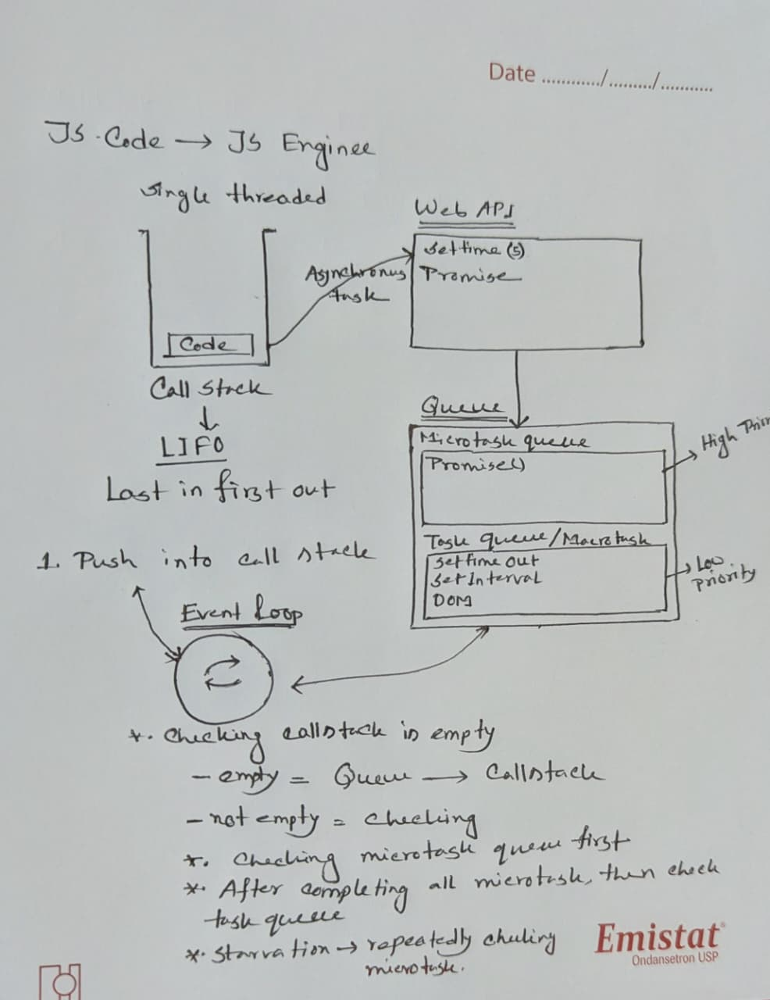

# What is the Event Loop?

The **Event Loop** is JavaScript’s behind-the-scenes traffic controller.  
It ensures your code runs in order without blocking, even though JavaScript is single-threaded (only one task runs at a time on the main thread).

## How the Event Loop Works

It coordinates two types of code:

- **Synchronous code** (runs immediately)
- **Asynchronous callbacks** (scheduled for later)

It does this by managing:

- The **Call Stack**
- The **Callback Queue** (Task Queue)
- The **Microtask Queue** (Promise callbacks, mutation observers)
- Checking for rendering opportunities between tasks

## Call Stack (Execution Stack)

- Stores currently executing functions.
- Works as **LIFO** (Last In, First Out).
- If the stack is blocked, nothing else can run — no events, no rendering.

## Web APIs

Provided by the browser (or Node.js in backend) to handle async operations such as:

- `setTimeout`, `setInterval`
- DOM events
- AJAX / Fetch API
- Geolocation
- Web Workers

> Note: `setTimeout` is **not part of JavaScript** — it’s handled by the browser.

---

## Callback Queue / Task Queue

- Holds callbacks waiting to be executed after the Call Stack is empty.
- Also called **Macrotask Queue**.

**Macrotask examples:**

- `setTimeout`
- `setInterval`
- I/O events
- `MessageChannel`

## Microtask Queue

- Has **higher priority** than the macrotask queue.
- Runs **immediately after the current function finishes**, but **before rendering** and before processing the next macrotask.

**Microtask examples:**

- `.then()` callbacks from Promises
- `queueMicrotask()`
- `MutationObserver`

## Event Loop Flow

1. Run all synchronous code on the Call Stack.
2. Empty the Microtask Queue completely.
3. Process one task from the Callback Queue (macrotasks).
4. Repeat the cycle.

> Microtasks always finish before moving to the next macrotask.

# Example

```js
console.log("Script Start");

setTimeout(() => console.log("setTimeout"), 0);

Promise.resolve().then(() => {
  console.log("Promise 1");
  queueMicrotask(() => console.log("Microtask inside Promise 1"));
});

Promise.resolve().then(() => console.log("Promise 2"));

console.log("Script End");
```

### Step-by-step:

1. Log "Script Start".
2. Schedule setTimeout → macrotask queue.
3. Promise 1 .then() → microtask queue.
4. Promise 2 .then() → microtask queue.
5. Log "Script End".
6. Microtask: "Promise 1".
7. Microtask inside Promise 1: "Microtask inside Promise 1".
8. Microtask: "Promise 2".
9. Macrotask: "setTimeout".

```js
//Output
Script Start
Script End
Promise 1
Microtask inside Promise 1
Promise 2
setTimeout
```

<br>
<br>

# Example -2

```js
console.log("first: start");

setTimeout(function timeout1() {
  console.log("timeout1: start");

  Promise.resolve().then(function promiseInTimeout() {
    console.log("promiseInTimeout");
  });

  console.log("timeout1: end");
}, 0);

Promise.resolve().then(function promise1() {
  console.log("promise1: start");

  Promise.resolve().then(function promise2() {
    console.log("promise2");
  });

  setTimeout(function timeout2() {
    console.log("timeout2");
  }, 0);

  console.log("promise1: end");
});

setTimeout(function timeout3() {
  console.log("timeout3: start");

  Promise.resolve().then(function promiseInTimeout3() {
    console.log("promiseInTimeout3");
  });

  console.log("timeout3: end");
}, 0);

console.log("first: end");
```

# Step-by-Step Explanation

1. **first: start** — synchronous log, runs immediately.
2. Schedule **timeout1** callback via `setTimeout` → goes to **macrotask queue**.
3. Schedule **promise1** callback via `Promise.then` → goes to **microtask queue**.
4. Schedule **timeout3** callback via `setTimeout` → goes to **macrotask queue**.
5. **first: end** — synchronous log, runs immediately.

---

### Microtasks run next (all microtasks drain before macrotasks):

6. **promise1: start** — microtask callback runs.
7. Inside **promise1**:
   - Schedule **promise2** microtask via another `Promise.then`.
   - Schedule **timeout2** macrotask via `setTimeout`.
8. **promise1: end** — still inside the microtask.
9. Next microtask runs:
   - **promise2** logs.

---

### Microtask queue empty → Event loop processes macrotasks in order:

10. Run **timeout1** macrotask:
    - Log **timeout1: start**.
    - Schedule microtask **promiseInTimeout**.
    - Log **timeout1: end**.
11. Microtask **promiseInTimeout** runs.
12. Run **timeout3** macrotask:
    - Log **timeout3: start**.
    - Schedule microtask **promiseInTimeout3**.
    - Log **timeout3: end**.
13. Microtask **promiseInTimeout3** runs.
14. Run **timeout2** macrotask:
    - Log **timeout2**.

---

```js
//Output
- first: start
- first: end
- promise1: start
- promise1: end
- promise2
- timeout1: start
- timeout1: end
- promiseInTimeout
- timeout3: start
- timeout3: end
- promiseInTimeout3
- timeout2
```

<br>

> Simulators: https://www.jsv9000.app/

# Note


