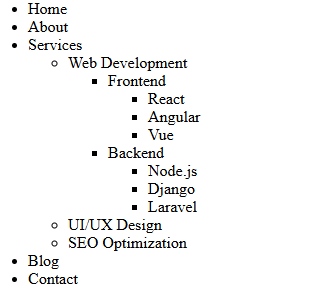

# Loops in JavaScript

## Loop Types and When to Use Them

| Loop Type    | Use When                                            |
| ------------ | --------------------------------------------------- |
| `for`        | You know exactly how many times to loop.            |
| `while`      | Loop while a condition is true; may not run at all. |
| `do...while` | Loop at least once, then check the condition.       |

## Loop Control Statements (Bonus)

-   `break` — exits the loop immediately.
-   `continue` — skips the current iteration and continues with the next.

## Loop Variants and Their Use Cases

| Loop       | Iterates Over              | Use For                           |
| ---------- | -------------------------- | --------------------------------- |
| `for...in` | Keys/properties (strings)  | Enumerating object properties     |
| `for...of` | Values of iterable objects | Arrays, strings, Maps, Sets, etc. |

<br><br>

## Array Iteration with Loops

### `for` Loop (traditional counter)

```js
for (let i = 0; i < carArr.length; i++) {
    console.log(carArr[i]);
}
```

-   Standard loop for index-based traversal.
-   Good when you need the index `i`.

---

### `while` Loop

```js
let x = 0;
while (x < carArr.length) {
    console.log(carArr[x]);
    x++;
}
```

-   Condition checked before each run.
-   Useful when condition may depend on something changing dynamically.

---

### `do...while` Loop

```js
let y = 0;
do {
    console.log(carArr[y]);
    y++;
} while (y < carArr.length);
```

-   Always runs at least once.
-   Good for menus, input validation, etc.

## Array Looping: `for...of` vs `for...in`

### ✅ `for...of` Loop (gets values)

```js
for (let a of carArr) {
    console.log(a);
}
```

-   Directly gives values from iterable (like arrays, strings).

### ✅ `for...in` Loop (gets indexes)

```js
for (let index in carArr) {
    console.log(index, carArr[index]);
}
```

-   Useful when you want to access both **index and value**.
-   Not ideal for arrays when order matters (use `for` or `for...of` instead).

## Looping through Object Properties

### ✅ `for...in` Loop (on object)

```js
for (let key in carObj) {
    console.log(key, carObj[key]);
}
```

-   Use `for...in` to loop through **keys of objects**.

## Object Property Filter with `break` & `continue`

```js
for (let key in user) {
    if (key === "email") continue; // Skip "email"
    if (key === "isActive") break; // Stop loop at "isActive"
    console.log(key, "→", user[key]);
}
```

-   Use `continue` to skip a property (e.g., skip `"email"`).
-   Use `break` to stop looping at a certain property (e.g., stop at `"isActive"`).

## 🎯 `do...while` with `break` condition

```js
let value;

do {
    value = Number(prompt());
    if (value === 500) break; // stop immediately if 500
} while (value !== 19000);

console.log(value);
```

-   Loops until a specific condition is met.
-   Use `break` to exit early (e.g., if value is `500`).

---

## 📌 Summary

| Loop Type    | Best For                                    |
| ------------ | ------------------------------------------- |
| `for`        | Counting, index-based loops                 |
| `while`      | Conditional loop, unknown length            |
| `do...while` | User input, retry logic, must-run scenarios |
| `for...of`   | Iterating array values                      |
| `for...in`   | Iterating object keys                       |

<br>

## Nav Menu

```js
//data
const menu = [
    {
        title: "Home",
    },
    {
        title: "About",
    },
    {
        title: "Services",
        subMenu: [
            {
                title: "Web Development",
                subMenu: [
                    {
                        title: "Frontend",
                        subMenu: [
                            { title: "React" },
                            { title: "Angular" },
                            { title: "Vue" },
                        ],
                    },
                    {
                        title: "Backend",
                        subMenu: [
                            { title: "Node.js" },
                            { title: "Django" },
                            { title: "Laravel" },
                        ],
                    },
                ],
            },
            {
                title: "UI/UX Design",
            },
            {
                title: "SEO Optimization",
            },
        ],
    },
    {
        title: "Blog",
    },
    {
        title: "Contact",
    },
];
```

```js
//Create nav using nested for loop - 4 level
const nav = document.getElementById("navId");
const menuLength = menu.length;
for (let i = 0; i < menuLength; i++) {
    const li = document.createElement("li");
    li.innerText = menu[i].title;

    if (menu[i].subMenu) {
        const ul = document.createElement("ul");
        const subMenuLenght1 = menu[i].subMenu.length;
        for (let j = 0; j < subMenuLenght1; j++) {
            const li2 = document.createElement("li");
            li2.innerText = menu[i].subMenu[j].title;

            if (menu[i].subMenu[j].subMenu) {
                const ul3 = document.createElement("ul");
                const subMenuLenght2 = menu[i].subMenu[j].subMenu.length;
                for (let k = 0; k < subMenuLenght2; k++) {
                    const li3 = document.createElement("li");
                    li3.innerText = menu[i].subMenu[j].subMenu[k].title;

                    if (menu[i].subMenu[j].subMenu[k].subMenu) {
                        const ul4 = document.createElement("ul");
                        const subMenuLenght3 =
                            menu[i].subMenu[j].subMenu[k].subMenu.length;
                        for (let l = 0; l < subMenuLenght3; l++) {
                            const li4 = document.createElement("li");
                            li4.innerText =
                                menu[i].subMenu[j].subMenu[k].subMenu[l].title;
                            ul4.appendChild(li4);
                        }
                        li3.appendChild(ul4);
                    }
                    ul3.appendChild(li3);
                }
                li2.appendChild(ul3);
            }
            ul.appendChild(li2);
        }
        li.appendChild(ul);
    }
    nav.appendChild(li);
}
console.log(menu);
```



```js
//Recursive
const menuArr = [];

function navDisplay(mainMenu) {
    for (let i = 0; i < mainMenu.length; i++) {
        menuArr.push(mainMenu[i].title);
        if (mainMenu[i].subMenu) {
            navDisplay(mainMenu[i].subMenu);
        }
    }
}
navDisplay(menu);
console.log(menuArr);
```

<br>

## Dropdown Form

```js
let allValue = [];
let submitValue = {};

const mainCategory = document.getElementById("mainCategory");
const foodSelection = document.getElementById("foodSelection");
const foodTypeSelect = document.getElementById("foodType");
const vegetableSelection = document.getElementById("vegetableSelection");
const vegetableType = document.getElementById("vegetableType");
const textInput = document.getElementById("textInput");

mainCategory.addEventListener("change", () => {
    const mainCategoryValue = mainCategory.value;
    console.log(mainCategoryValue);

    foodSelection.style.display = "none";
    vegetableSelection.style.display = "none";
    textInput.style.display = "none";
    foodTypeSelect.value = "";
    vegetableType.value = "";

    if (mainCategoryValue === "Food") {
        submitValue.category = "Food";
        foodSelection.style.display = "block";
    } else if (mainCategoryValue === "Clothing") {
        submitValue.category = "Clothing";
        textInput.style.display = "block";
    }
});

foodTypeSelect.addEventListener("change", () => {
    const foodTypeValue = foodTypeSelect.value;
    vegetableSelection.style.display = "none";
    textInput.style.display = "none";
    vegetableType.value = "";

    console.log(foodTypeValue);

    if (foodTypeValue === "Fruit") {
        submitValue.type = "Fruit";
        textInput.style.display = "block";
    } else if (foodTypeValue === "Vegetable") {
        submitValue.type = "Vegetable";
        vegetableSelection.style.display = "block";
    }
});

vegetableType.addEventListener("change", () => {
    const vegetableTypeValue = vegetableType.value;
    submitValue.subType = vegetableTypeValue;
    textInput.style.display = "block";
});

function submitBtn(e) {
    e.preventDefault();
    const inputVal = document.getElementById("itemInput").value;
    console.log(inputVal);
    submitValue.name = inputVal;
    console.log(submitValue);
    allValue.push(submitValue);
    submitValue = {};
    mainCategory.value = "";
    foodSelection.style.display = "none";
    vegetableSelection.style.display = "none";
    textInput.style.display = "none";
    foodTypeSelect.value = "";
    vegetableType.value = "";
    console.log(allValue);
}
```

```js
//Display inputs
// const newObj = [
//     { category: "Food", type: "Fruit", name: "A" },
//     { category: "Food", type: "Vegetable", subType: "Fresh", name: "A" },
//     { category: "Food", type: "Vegetable", subType: "Dried", name: "A" },
//     { category: "Clothing", name: "A" },
// ];

function displayAllInputValue() {
    let i = 1;

    for (let value of allValue) {
        console.log("Input - ", i);
        for (let key in value) {
            console.log(`${key} : ${value[key]}`);
        }
        i++;
    }
}
```

[Watch Demo Video](./screen-capture.webm)
